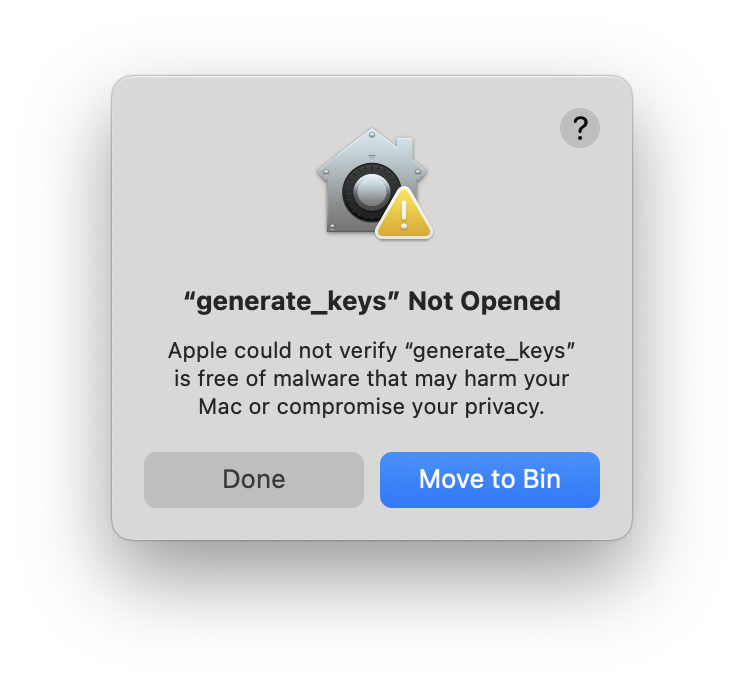
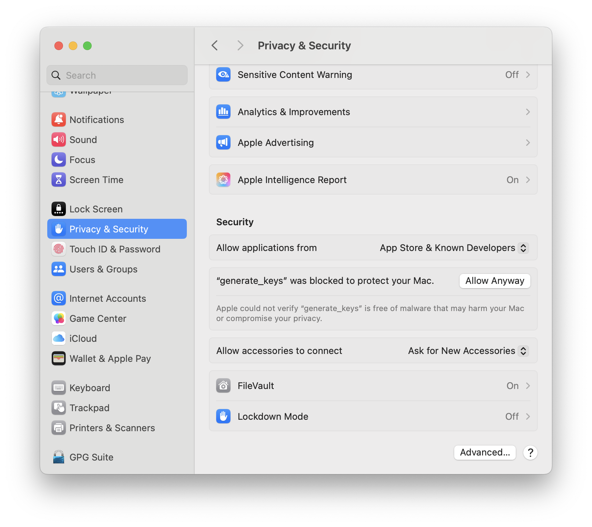
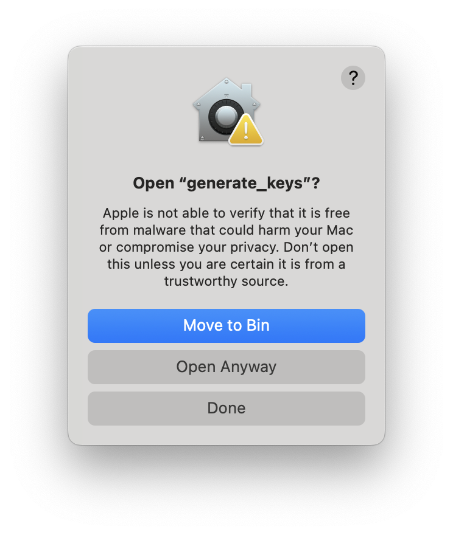
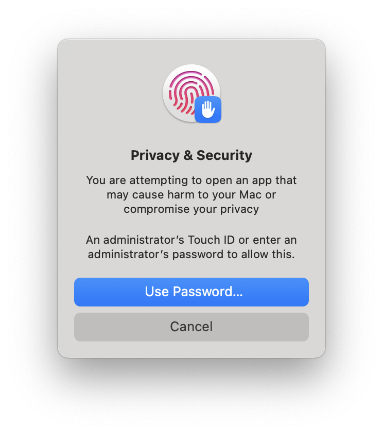

# Wails 3: Sparkle Updater PoC

This repository contains a Hello World build of a [Wails 3](https://v3alpha.wails.io/) app, using the [Sparkle](https://github.com/sparkle-project/Sparkle) framework by way of [go-sparkle](https://github.com/abemedia/go-sparkle).


https://github.com/user-attachments/assets/b0204772-2983-42bc-b750-43c066f8e684

I've only tested this on macOS but the same effect should be achievable by way of [go-winsparkle](https://github.com/abemedia/go-winsparkle).

The main point of this repo is to both provide an example and capture the exact steps required to achieve this, both for myself in future and for the wider Wails community.

The process can surely be tidied up and made more generic so consider this a minimal working prototype rather than a finished product.

## Walkthrough

Most of this walkthrough will be concerned with packaging up a standalone app for use as an update binary. Technically what we're doing here is packaging up our "future" app as we'll then need to create a second app that can download the "future" app.

The way that I simulate this visually for myself is with a fake version field in `frontend/index.html` that is currently set to `1.0.0` in the repo but that I manually decrement to `0.9.0` later on.

### Wiring up Sparkle (Code)

This is functionally the easiest part of this process thankfully.

#### Go

Within `main.go`, you'll see that we import `go-sparkle` with a leading underscore to signify that we won't be referring to the package directly.

```go
import (
   _ "github.com/abemedia/go-sparkle"
)
```

This is actually all that we need within our code to work with updates as a cocoa loop will be automatically created in the background.

On first launch of your app (of any version, it won't reset for newer versions), you'll be asked if you want to automatically check for updates.

If you select yes, you'll get a prompt whenever an update is available which can be during the life of the application but if you regularly open and close apps, you'll likely notice these on startup.

If you select no, you'll need to manually provide some way to trigger updates. For this demo, we do this within `greetservice.go` like so:

```go
func (g *GreetService) Greet() {
	sparkle.CheckForUpdates()
}
```

but the more "native" way to do this would be to add a menu item under `<App Name> -> Check for Updates`.

### Wiring up Sparkle (Build Process)

With `go-sparkle` wired up in our codebase, we still need to actually download the Sparkle framework and package it up inside our application.

As a start, we'll download the latest Sparkle package [from Github](https://github.com/sparkle-project/Sparkle/releases) and extract it into our Downloads folder. For this build, I'm using [Sparkle 2.6.4](https://github.com/sparkle-project/Sparkle/releases/tag/2.6.4) so the contents may differ slightly in future.

Inside, we should see a bunch of different folders, some of which will become important later on:

```shell
$ tree -L 2
.
├── CHANGELOG
├── INSTALL
├── LICENSE
├── SampleAppcast.xml
├── Sparkle Test App.app
│   └── Contents
├── Sparkle.framework
│   ├── Autoupdate -> Versions/Current/Autoupdate
│   ├── Headers -> Versions/Current/Headers
│   ├── Modules -> Versions/Current/Modules
│   ├── PrivateHeaders -> Versions/Current/PrivateHeaders
│   ├── Resources -> Versions/Current/Resources
│   ├── Sparkle -> Versions/Current/Sparkle
│   ├── Updater.app -> Versions/Current/Updater.app
│   ├── Versions
│   └── XPCServices -> Versions/Current/XPCServices
├── Symbols
│   ├── Autoupdate.dSYM
│   ├── BinaryDelta.dSYM
│   ├── Downloader.xpc.dSYM
│   ├── Installer.xpc.dSYM
│   ├── Sparkle Test App.app.dSYM
│   ├── Sparkle.framework.dSYM
│   ├── Updater.app.dSYM
│   ├── generate_appcast.dSYM
│   ├── generate_keys.dSYM
│   ├── sign_update.dSYM
│   └── sparkle.app.dSYM
├── bin
│   ├── BinaryDelta
│   ├── generate_appcast
│   ├── generate_keys
│   ├── old_dsa_scripts
│   └── sign_update
└── sparkle.app
    └── Contents

27 directories, 10 files
```

For now, we'll take `Sparkle.framework` and move it into a folder called `Frameworks` within our `build` folder:

```shell
mkdir build/Frameworks
mv ~/Downloads/Sparkle-2.6.4/Sparkle.framework build/Frameworks
```

You can put it anywhere in the build folder really but I've chosen to put it inside `Frameworks` as the standard is to have a `Frameworks` folder inside your macOS app. If you right click on an app in `Applications` and click `Show Package Contents`, you can see this within a number of apps. An example would be `/System/Applications/FindMy.app/Contents/Frameworks` which contains `FindMyAppCore.framework`.

Next, we need to wire up our build to move the Sparkle framework into our resulting app bundle, as well as setting up some special `CGO_LDFLAGS` which we can do within `build/Taskfile.darwin.yml`.

> [!NOTE]
> `Taskfile.darwin.yml` is exactly the same as the default template generated by Wails v3.0.0-alpha.8.3 so the shape as well as names of tasks may change in future.

#### Moving Sparkle into the app bundle

Within `Taskfile.darwin.yml`, under `create:app:bundle`, we'll add the following line to copy the Sparkle framework into our app.

> [!TIP]
> You'd probably want to modify this to just copy the entire `Frameworks` folder, in the event that there are more than one framework used by your app in future.

```diff
  create:app:bundle:
    summary: Creates an `.app` bundle
    cmds:
      - mkdir -p {{.BIN_DIR}}/{{.APP_NAME}}.app/Contents/{MacOS,Resources,Frameworks}
      - cp build/icons.icns {{.BIN_DIR}}/{{.APP_NAME}}.app/Contents/Resources
      - cp {{.BIN_DIR}}/{{.APP_NAME}} {{.BIN_DIR}}/{{.APP_NAME}}.app/Contents/MacOS
      - cp build/Info.plist {{.BIN_DIR}}/{{.APP_NAME}}.app/Contents
+     - cp -R build/Frameworks/Sparkle.framework {{.BIN_DIR}}/{{.APP_NAME}}.app/Contents/Frameworks
```

#### Setting up CGO_LDFLAGS

Under the `env` block of the `build` task for `Taskfile.darwin.yml`, we add the following section to `CGO_LDFLAGS`:

```text
-rpath,@loader_path/../Frameworks
```

Note that this path is where the Frameworks folder is relative to where our binary will be inside of our resulting app bundle so eg;

```text
bin/updater3.app/MacOS/updater3
bin/updater3.app/MacOS
bin/updater3.app/MacOS/Frameworks (Sparkle.framework lives here)
```

#### Setting up our appcast path

Lately, we need to tell our app where to actually find updates, which we can do by add a few special entries to `build/Info.plist`.

```diff
    <key>CFBundleIdentifier</key>
    <string>com.wails.updater3</string>
+   <key>SUFeedURL</key>
+   <string>http://localhost:8000/appcast.xml</string>
+   <key>SUEnableAutomaticChecks</key>
+   <false/>
```

Note that `SUFeedURL` would normally be hosted externally somewhere but for this experiment, it lives under `static/appcast.xml` and will be served using `python -m http.server` which defaults to `localhost:8000`.

For this experiment, I've disabled automatic checking as I wired updates to a button but for a real product, I would leave this up to the user.

You can find a full list of valid plist entries [here](https://sparkle-project.org/documentation/customization/).

We have one more plist entry to add but we need to make a quick detour first.

### Setting up our Sparkle signing key

When we have a new update available to distribute to users, we sign it with a private key. Our distributed app has a public key and can confirm that updates were signed with the private key that said public key was derived from[^1].

In order for our Sparkle updates to work, we need to generate public/private keypair so we can embed our public key in the app as well as sign updates we want to distribute.

Going back to the Sparkle folder that we downloaded earlier, we can see a bunch of CLI tools in a folder called `bin`:

```shell
$ tree -L 2
.
├── CHANGELOG
├── INSTALL
[...]
├── bin
│   ├── BinaryDelta
│   ├── generate_appcast
│   ├── generate_keys
│   ├── old_dsa_scripts
│   └── sign_update
```

The tool we're after here is called `generate_keys` which will generate a public/private keypair and store the private key in our local [keychain](https://en.wikipedia.org/wiki/Keychain_(software)).

#### Satisfying macOS Gatekeeper

Upon first trying to run `./bin/generate_keys`, you'll run into macOS Gatekeeper as these binaries are not signed. I'll outline this step once in detail so you can refer back to this section when we use another tool later on.

Upon first run, you'll be presented with a popup letting you know that the tool you tried to run is blocked



To move forward, open up `System Settings` and navigate to `Privacy & Security` and scroll to the bottom.

> [!NOTE]
> The naming above is as of macOS Sequoia 15.3. In previous versions of macOS, Security was a standalone tab off the top of my head



You should see a prompt about how `generate_keys` was blocked so click "Allow Anyway".

If you don't see the prompt, try running `generate_keys` again as prompts don't stack, they only show the most recently run binary.

After clicking "Allow Anyway", running `generate_keys` again should show the following pop up.



Click "Open Anyway" and lastly, you'll be greeted by request to authenticate.



You should finally be see the output of `generate_keys` which looks like so:

```shell
$ ./bin/generate_keys
Generating a new signing key. This may take a moment, depending on your machine.
A key has been generated and saved in your keychain. Add the `SUPublicEDKey` key to
the Info.plist of each app for which you intend to use Sparkle for distributing
updates. It should appear like this:

    <key>SUPublicEDKey</key>
    <string>wiI5O/SGcbX9VdcIN+hBXvV66KI3gpTTlHMelslKsg0=</string>
```

#### Continued signing key setup

Now that we have a public key, we'll want to add the above plist snippet to `build/Info.plist` like so:

```diff
    <key>CFBundleIdentifier</key>
    <string>com.wails.updater3</string>
    <key>SUFeedURL</key>
    <string>http://localhost:8000/appcast.xml</string>
    <key>SUEnableAutomaticChecks</key>
    <false/>
+   <key>SUPublicEDKey</key>
+   <string>wiI5O/SGcbX9VdcIN+hBXvV66KI3gpTTlHMelslKsg0=</string>
```

With that, we're now ready to package up our app finally.

### Packaging our app

At the time of writing, the packaging process is fairly straight forward, looking like so:

```shell
$ wails3 build
$ wails3 package
```

This should generate `bin/updater3.app` which can launch although updates won't work just yet as we don't have any updates available.

### Codesigning our app

Unfortunately, as far as I can tell, we need to codesign our application with a developer certificate for Sparkle to be happy? This may not actually be true as I ran into a few different issues getting signing all working but I haven't confirmed either way.

This isn't the same as notarisation to be clear, we don't necessarily need to submit our app to Apple, although you would probably need to do that with external users or else they'd run into macOS Gatekeeper issues.

I'm going to handwave the actual process of setting up codesigning and assume you have a signing certificate available locally on your machine.

You can check this by running `security find-identity -v -p codesigning` which should show any valid identities in the format of `Developer ID Application: Human Person (TEAMIDHERE)"`.

The main catch is that we don't necessarily need to codesign our actual app but we do need to codesign the Sparkle framework and a few of its internals as it technically is comprised of multiple pieces.

We can do that like so:

```bash
CODE_SIGN_IDENTITY="Developer ID Application: Human Person (TEAMIDHERE)"

codesign -f -s "$CODE_SIGN_IDENTITY" -o runtime bin/updater3.app/Contents/Frameworks/Sparkle.framework/Versions/B/XPCServices/Installer.xpc

# For Sparkle versions >= 2.6
codesign -f -s "$CODE_SIGN_IDENTITY" -o runtime --preserve-metadata=entitlements bin/updater3.app/Contents/Frameworks/Sparkle.framework/Versions/B/XPCServices/Downloader.xpc

# For Sparkle versions < 2.6
#codesign -f -s "$CODE_SIGN_IDENTITY" -o runtime --entitlements Entitlements/Downloader.entitlements bin/updater3.app/Contents/Frameworks/Sparkle.framework/Versions/B/XPCServices/Downloader.xpc

codesign -f -s "$CODE_SIGN_IDENTITY" -o runtime bin/updater3.app/Contents/Frameworks/Sparkle.framework/Versions/B/Autoupdate
codesign -f -s "$CODE_SIGN_IDENTITY" -o runtime bin/updater3.app/Contents/Frameworks/Sparkle.framework/Versions/B/Updater.app
codesign -f -s "$CODE_SIGN_IDENTITY" -o runtime bin/updater3.app/Contents/Frameworks/Sparkle.framework
```

> [!TIP]
> If you're currently using a third party tool like [Gon](https://github.com/Bearer/gon) for both codesigning and notarisation, you'll likely need to change your config to do notarisation only. As such, you may end up having to do some steps that came for free such as zipping and stapling your app.

### Moving our app to our fake update server

With that all done, we just need to package up our app and move it over to the `static` folder, which in a real app would be our update server (a standard file server or a CDN perhaps).

```bash
ditto -c -k --sequesterRsrc --keepParent bin/updater3.app bin/updater3.zip
```

### Updating appcast with our update

Now that we have an app all packaged and ready to go, we still need to sign it with our private key to generate a signature and add an entry to our appcast.

There isn't a formal appcast spec but you can see an example in `static/appcast.xml` as well as by referring to the [Sparkle docs](https://sparkle-project.org/documentation/publishing/).

The main thing we need to worry about is the `enclosure` block which will look like so in the final product:

```bash
<enclosure url="https://example.com/updater3.zip" sparkle:edSignature="<signature>" length="<length>" type="application/octet-stream" />
```

> [!WARNING]
> You **MUST** serve your appcast updates over HTTPS or else your app will receive an update error stating `The update is improperly signed and could not be validated.`. This is [due to Apple's App Transport Security requirements](https://sparkle-project.org/documentation/#3-segue-for-security-concerns) which are present on macOS 10.11 and later.

In order to obtain a signature (and calculate file length), we need to use another of the Sparkle CLI tools which will read our private key that we stored in our local keychain earlier.

```bash
$ ~/Downloads/Sparkle-2.6.4/bin/sign_update static/updater3.zip
sparkle:edSignature="+h5Cqd1o9iZuQzzHT66jwnSbXiVLWUwfDW5mpUwA7wKUJM+zGuu/WB0M/kcGidjqUn9DsAJ6FEfofGKtlBaCDw==" length="4458945"
```

Our new `appcast.xml` entry would gain these two attributes like so:

```diff
-<enclosure url="https://example.com/updater3.zip" sparkle:edSignature="<signature>" length="<length>" type="application/octet-stream" />
+<enclosure url="https://example.com/updater3.zip" sparkle:edSignature="+h5Cqd1o9iZuQzzHT66jwnSbXiVLWUwfDW5mpUwA7wKUJM+zGuu/WB0M/kcGidjqUn9DsAJ6FEfofGKtlBaCDw==" length="4458945" type="application/octet-stream" />
```

From here, you would move `bin/updater3.zip` to your remote server that can serve files over HTTPS. While our appcast file can be served locally, our actual update can't be served over HTTP as mentioned above.

Presumably you can simulate this locally with a combination of [mkcert](https://github.com/FiloSottile/mkcert) and a reverse proxy like nginx but I haven't tried yet.

### Receiving updates

Assuming you've moved `bin/updater3.zip` to a remote location, you can start up your local appcast server like so, assuming you have a relatively new version of Python 3 (which comes built into macOS):

```bash
$ cd static
$ python -m http.server
Serving HTTP on :: port 8000 (http://[::]:8000/) ...
```

You can confirm that everything is working with `curl`:

```bash
$ curl http://localhost:8000/appcast.xml
<?xml version="1.0" encoding="utf-8"?>
<rss version="2.0" xmlns:sparkle="http://www.andymatuschak.org/xml-namespaces/sparkle"  xmlns:dc="http://purl.org/dc/elements/1.1/">
        <channel>
                <title>App Changelog</title>
                <link>http://localhost:8000/appcast.xml</link>
                <description>Most recent changes with links to updates.</description>
                <language>en</language>
                <item>
                        <title>Version 1.0</title>
                        <sparkle:version>1.0.0</sparkle:version>
                        <description><![CDATA[
                                <h2>Release notes</h2>
                                <ul>
                                        <li>Added a new feature</li>
                                </ul>
                                <h2>Bug Fixes</h2>
                                <ul>
                                <li>Got rid of something or other</li>
                                </ul>
                        ]]>
                        </description>
                        <pubDate>Mon, 01 Jan 2025 20:30:00 +1300</pubDate>
                        <enclosure url="http://localhost:8000/updater3.zip" sparkle:edSignature="jkl1QZbrhvwRfOX+DqGSIRoB4ZdirHuWOhfYDKlEiyHi7Yt5BiZtAGtIRramT2TnBfNzEEqoWBC72TA9bV5pDg==" length="4458945" type="application/octet-stream" />
                </item>                                                                                                        </channel>
</rss>
```

Finally, you can either open `bin/updater` (it will likely consider the update in `appcast.xml` newer than itself) or make a new version with a decremented version, spin it up and you should be able to update your app in place:

https://github.com/user-attachments/assets/b0204772-2983-42bc-b750-43c066f8e684

## Glossary

Before we continue too far, I'll elaborate a bit more on some background for those less familiar with macOS.

### Sparkle

A macOS [framework](https://developer.apple.com/library/archive/documentation/MacOSX/Conceptual/BPFrameworks/Concepts/WhatAreFrameworks.html) that provides all of the functionality needed by developers for updating apps.

Once plugged into your application, it will depending on user preference, either check for updates in the background periodically or only check for updates once explicitly triggered (usually via the menu bar under `<App Name> -> Check for Updates`)

If you've seen this pop up before, that's the updater provided by Sparkle.


Outside of the macOS App Store, Apple doesn't officially provide a way to update apps so Sparkle is the defacto way to do that and is widely used.

It also has support for deltas (only download what has changed instead of the whole app), signed updates (to ensure update files haven't been tampered with) and a bunch of other functionality.

The way that updates are distributed is that the app in question knows about an "appcast" file, which is just a specially formatted XML file. You can check `static/appcast.xml` for an example.

On startup, an app with Sparkle will check the appcast file to see if it contains an update entry newer than the current version of the app. If one exists, it will download the update, verify its integrity (refusing to continue if the signature doesn't match up)

### WinSparkle

A Windows project that functionally ports all of Sparkle to Windows. I haven't looked at it too closely but at a glance, it seems that the API exposed by WinSparkle is almost (if not entirely) identical to Sparkle, which is good for interoperability.


[^1]: I always forget the specifics of public/private so I'm handwaving a bit as this README is already long enough.
